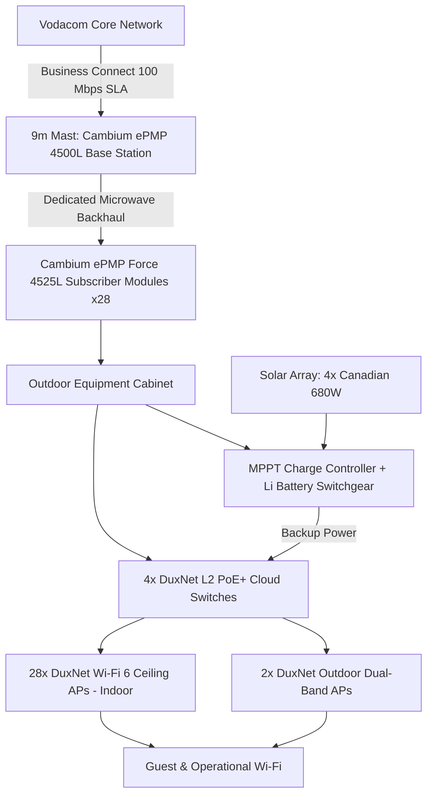

# CTTX Services — Formal Quote

**Client:** Barefoot Addo Elephant Lodge (Pty) Ltd
**Site Contact:** Shelley Hills (Finance/HR) — 041 585 0675
**Site Coordinates:** -33.3035020, 25.7362700
**Quote Date:** 25 September 2026
**Valid Until:** 25 October 2026 (30 days)
**Prepared by:** Gerhard Smit, CTTX Services (Pty) Ltd

---

## Executive Summary

### Included
- Private wireless distribution network: 28× indoor Wi-Fi 6 ceiling APs, 2× outdoor Wi-Fi 6 APs, 4× managed L2 PoE+ switches
- Cambium ePMP backhaul radio pair (base station + subscriber modules) mounted on a 9m mast with plinth
- Outdoor equipment cabinet with MPPT solar charge controller and lithium battery switchgear
- Solar power generation (4× 680W panels) with grid-interactive inverter for off-grid resilience
- Comprehensive earthing/lightning protection system (CTTX scope — no separate surge suppressor hardware required)
- Site survey, installation, commissioning, testing, and documentation handover
- Vodacom Business Connect 100 Mbps symmetrical carrier connectivity (uncontended, business SLA)

### Excluded
- Trenching or underground civil work (none required — this is a wireless solution)
- Body corporate / landlord approvals (not applicable — freestanding lodge property)
- CCTV cameras, POS hardware, or other endpoint devices not listed in the BOM
- Ongoing managed service (offered as a separate optional add-on below)
- Any works beyond the confirmed coverage zones without a change order

### Assumption Flagged
Line-of-sight from the proposed mast position to the Vodacom Business Connect handoff point has **not yet been formally confirmed**. Pricing below is presented on the basis that feasibility is confirmed during site survey. If LOS is not clear from the current mast position, a design revision may be required before final sign-off.

---

## Network Topology

---

## 1. Hardware BOM (Excl. VAT)

| Item | Model | Qty | Unit Price | Total |
|------|-------|-----|-----------|-------|
| Backhaul Base Station | Cambium ePMP 4500L 5GHz AP, 2x2, AC PoE | 2 | R8,470 | R16,940 |
| Sector Antenna | ePMP Sector Antenna 5GHz 90/120° | 2 | R3,209 | R6,418 |
| Subscriber Modules | Cambium ePMP Force 4525L, 25dBi | 28 | R2,745 | R76,860 |
| Indoor Access Points | DuxNet Wi-Fi 6 Ceiling AP, 1Gb WAN/LAN | 28 | R1,025 | R28,700 |
| Outdoor Access Points | DuxNet Outdoor Dual-Band Wi-Fi 6 AP | 2 | R1,885 | R3,770 |
| Network Switches | DuxNet 8-Port Gigabit PoE+ L2 Cloud Switch | 4 | R1,899 | R7,596 |
| **Hardware Subtotal** | | | | **R140,284.00** |

*Source: Duxbury Networking Quote DUX00455421 v2 (ePMP subscriber modules ETA mid-November 2026 — all other items in stock).*

## 2. Outdoor Infrastructure & Civil (Excl. VAT)

*Mast, cabinet, and mounting hardware are not standard rate-card items — priced as supplier/stock quotes specific to this site.*

| Item | Qty | Unit Price | Total |
|------|-----|-----------|-------|
| 9m Galvanized Steel Mast with Plinth, installed (CTTX second-hand stock) | 1 | R38,700 | R38,700.00 |
| Outdoor Cabinet w/ MPPT Charge Controller & Lithium Battery Switchgear | 1 | R28,670 | R28,670.00 |
| Solar Panels — Canadian Solar 680W Monocrystalline | 4 | R2,200 | R8,800.00 |
| Grid/Solar Inverter | 1 | R2,150 | R2,150.00 |
| Outdoor Cabling — mast-to-cabinet, WAN, AP runs (avg. 40m run) | 40m | R12/m | R480.00 |
| Mounting Brackets & Hardware (radio, AP, solar mounts) | 15 | R450 | R6,750.00 |
| **Infrastructure Subtotal** | | | **R85,550.00** |

> **Note on cabling rate:** R12/m is below CTTX's standard rate-card price for shielded/armoured outdoor cable (R28–45/m). This reflects a bulk/lighter-grade cable assumption. **Confirm actual cable grade and total run length at site survey** — this line is subject to adjustment once real distances and cable spec are confirmed on site.

## 3. Labour (Excl. VAT)

| Task | Effort | Rate | Total |
|------|--------|------|-------|
| Site survey and design | 1 day | R4,500/day | R4,500.00 |
| Installation — AP deployment, cabling, PoE, switch configuration (2-tech team) | 3 days | R9,000/day | R27,000.00 |
| Commissioning and testing | 1 day | R4,500/day | R4,500.00 |
| Documentation and handover | 1 half-day | R2,250 | R2,250.00 |
| **Labour Subtotal** | | | **R38,250.00** |

*Travel/accommodation not applied — Addo is a ~1h45 drive from PE, assumed day trips. To be confirmed if overnight stays are required for the 3-day install.*

*Trenching: Not applicable — wireless solution, no underground civil works required.*

## 4. Summary Pricing (CAPEX)

| Line | Amount (Excl. VAT) |
|------|---------------------|
| Hardware Subtotal | R140,284.00 |
| Infrastructure Subtotal | R85,550.00 |
| Labour Subtotal | R38,250.00 |
| **Subtotal (1+2+3)** | **R264,084.00** |
| Contingency (10%) | R26,408.40 |
| **Project Total (Excl. VAT)** | **R290,492.40** |
| VAT (15%) | R43,573.86 |
| **TOTAL INFRASTRUCTURE INVESTMENT (Incl. VAT)** | **R334,066.26** |

---

## 5. Monthly Recurring — Carrier Connectivity

**Vodacom Business Connect 100 Mbps** — Uncontended (1:1), Uncapped, Unshaped, No FUP, Symmetrical, Business SLA, Huawei router included, 1 static IP standard. 24-month contract. Subject to feasibility confirmation.

| Item | Price (Excl. VAT) | Price (Incl. VAT) |
|------|---------------------|---------------------|
| Monthly Recurring Charge | R7,103.00 | R8,168.00 |
| Once-off Connection Fee (NRC) | R3,130.00 | R3,599.00 |

**24-Month Contract Value:** R170,472.00 (excl. VAT) / R196,032.00 (incl. VAT)

---

## 6. Optional Add-On — CTTX Managed Service Retainer

Recommended given the complexity of this deployment (private mast, solar/battery power system, 30-radio network requiring remote monitoring per CTTX's cloud-monitorable infrastructure standard):

| Tier | Monthly (Excl. VAT) | Monthly (Incl. VAT) | Includes |
|------|----------------------|----------------------|----------|
| Managed Service Retainer | R4,500 | R5,175 | Remote monitoring (Cambium cnMaestro + Victron), proactive maintenance, quarterly on-site visits, battery/solar health checks, priority emergency support |

*Range R3,500–R5,500/month depending on SLA response time selected; R4,500 shown as the recommended mid-tier for this site's complexity.*

---

## 7. Cost of Disconnection vs Value of Connected Operations

Barefoot Addo Elephant Lodge currently operates 23 individually-managed Wi-Fi access points across the property, dependent on Herotel's shared best-effort backhaul. This creates specific, quantifiable exposure:

- **Guest experience risk:** Contended bandwidth degrades during peak occupancy — the exact time guest-facing systems (bookings, POS, communication) matter most.
- **Operational blindness:** Multiple independent APs with no centralized monitoring means outages are discovered reactively, not proactively — no one is watching the system until a guest or staff member reports a problem.
- **Vendor dependency:** Complete reliance on Herotel for both connectivity and Wi-Fi equipment management means the lodge has no infrastructure of its own and no leverage if service quality or pricing changes.
- **Single point of failure:** No solar/battery backup on the current setup — a power outage takes the entire guest and operational network down with it.

CTTX's proposed solution converts this into owned, remotely-monitored infrastructure (Cambium cnMaestro + Victron visibility) with solar-backed resilience — turning an unmanaged liability into a measured, supportable asset.

---

## 8. Financial Comparison — Current (Herotel) vs Proposed (CTTX)

### Current Herotel Costs (Invoice #8313058, 31 Aug 2026)

| Item | Monthly (Incl. VAT) |
|------|----------------------|
| Business WTTB 100 Mbps Symmetrical | R11,498.85 |
| Static IP | R207.00 |
| 23x Huawei Wi-Fi 6 AP 362 (Managed-lite, mixed 12M/24M terms) | R6,057.05 |
| Managed Wi-Fi (Lite) 0-5 | R342.70 |
| **Herotel Total** | **R18,105.60/month** |

### Proposed CTTX Solution

| Scenario | Monthly (Incl. VAT) | vs Herotel |
|----------|----------------------|------------|
| Vodacom Business Connect only (lodge self-maintains AP network) | R8,168.00 | **−R9,937.60/month** |
| Vodacom Business Connect + CTTX Managed Service Retainer | R13,343.00 | **−R4,762.60/month** |

### Break-Even on Infrastructure Investment

Total upfront (infrastructure R334,066.26 + Vodacom NRC R3,599.00) = **R337,665.26**

| Scenario | Monthly Saving | Break-Even |
|----------|-----------------|------------|
| Without managed retainer | R9,937.60 | **34 months** (~2.8 years) |
| With managed retainer | R4,762.60 | **71 months** (~5.9 years) |

**Recommendation:** Take the managed service retainer. The break-even extends, but so does the risk coverage — this is infrastructure the lodge will depend on for guest experience and operations; unmonitored private infrastructure is not something CTTX deploys as a matter of policy (remote visibility is core to the design, not optional).

---

## 9. Risk Table

| Risk | Likelihood | Impact | Mitigation |
|------|-----------|--------|------------|
| LOS not confirmed from proposed mast position | Medium | High | Site survey (included) confirms LOS before final commitment; design revision if required |
| Vodacom feasibility delay/rejection at this specific site | Low–Medium | High | Feasibility check submitted early in process; fallback options assessed if declined |
| ePMP Force 4525L stock delay (ETA mid-Nov 2026) | Confirmed | Medium | Installation phased — mast/cabinet/solar/switches proceed first; subscriber modules follow on confirmed ETA |
| Cable run distances differ from 40m estimate | Medium | Low–Medium | Confirmed on-site survey; cable line item adjusted before final invoice if materially different |
| Power system undersized for load (28 APs + backhaul) | Low | High | Solar/battery sizing validated during design phase against actual measured load |
| No managed retainer taken — issues go undetected | Medium | Medium–High | Recommended as add-on; lodge to confirm decision before go-live |

---

## 10. Exclusions

- Trenching / underground civil works
- Body corporate or landlord approvals
- Endpoint devices (CCTV, POS terminals, telephony handsets) not listed in BOM
- Ongoing managed service (unless the optional retainer is selected)
- Any scope beyond confirmed coverage zones without a signed change order
- Travel/accommodation beyond day-trip assumption (to be confirmed at survey)

---

## 11. Payment Terms

- **Validity:** 30 days from quote date
- **Payment:** 50% deposit on order / 50% on commissioning sign-off
- **Warranty:** 24 months hardware, 12 months installation
- **Lead time:** 10–15 working days from deposit (subject to ePMP Force 4525L stock ETA — see Risk Table)

---

## 12. Next Steps

1. Confirm site survey date (feasibility + LOS confirmation)
2. Submit Vodacom Business Connect feasibility request for this site
3. Confirm managed service retainer decision
4. Approve quote and pay deposit to commence

---

**Prepared by:** Gerhard Smit | CTTX Services (Pty) Ltd
📞 084 550 3281 | ✉️ gerhard@cttx.co.za | 🌐 cttx.co.za
