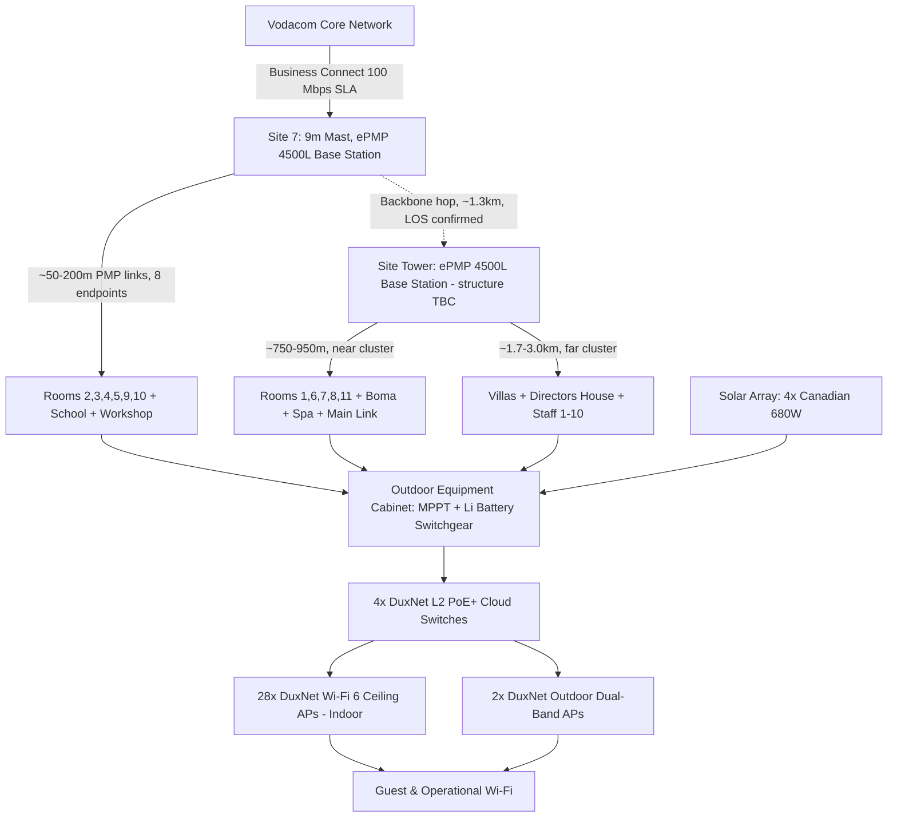

# CTTX Services — Formal Quote

**Client:** Barefoot Addo Elephant Lodge (Pty) Ltd
**Site Contact:** Shelley Hills (Finance/HR) — 041 585 0675
**Site Coordinates:** -33.3035020, 25.7362700
**Quote Date:** 25 September 2026
**Valid Until:** 25 October 2026 (30 days)
**Prepared by:** Gerhard Smit, CTTX Services (Pty) Ltd

---

## Executive Summary

### Included
- Private wireless distribution network: 28× indoor Wi-Fi 6 ceiling APs, 2× outdoor Wi-Fi 6 APs, 4× managed L2 PoE+ switches
- Cambium ePMP backhaul radio pair (base station + subscriber modules) mounted on a 9m mast with plinth
- Outdoor equipment cabinet with MPPT solar charge controller and lithium battery switchgear
- Solar power generation (4× 680W panels) with grid-interactive inverter for off-grid resilience
- Comprehensive earthing/lightning protection system (CTTX scope — no separate surge suppressor hardware required)
- Site survey, installation, commissioning, testing, and documentation handover
- Vodacom Business Connect 100 Mbps symmetrical carrier connectivity (uncontended, business SLA)

### Excluded
- Trenching or underground civil work (none required — this is a wireless solution)
- Body corporate / landlord approvals (not applicable — freestanding lodge property)
- CCTV cameras, POS hardware, or other endpoint devices not listed in the BOM
- Ongoing managed service (offered as a separate optional add-on below)
- Any works beyond the confirmed coverage zones without a change order

### ⚠️ CORRECTION (26 Sept 2026) — Field RF Survey Received

Abel Ringisai (CTTX Wireless Team Leader) has already completed the actual RF link-planning survey for this site (KML export, field-dated 22 September 2026). This is **real, confirmed LOS data** — not an assumption — and it changes two things the original draft got wrong:

1. **LOS is confirmed, not pending.** Every one of the 28 subscriber links below has a modeled Fresnel/LOS profile in Abel's survey. The "LOS not yet confirmed" language below is superseded.
2. **This is a two-site network, not a single mast.** The survey shows two separate base station locations — site **"7"** (co-located with the main lodge, serving 8 close-range links) and site **"Tower"** (~1.3km away, serving 20 links including a long-range hop of up to 3km to the staff village). The BOM below prices **one** 9m mast with plinth. **Open question for Gerhard: is "Tower" an existing structure already on site, or does this design require a second mast that is not yet priced?** This must be resolved before the quote is finalized — see Section 13.

---

## Network Topology (Corrected — Two-Site Design per Field Survey)

---

## Field RF Survey — Link Detail (Source: Abel Ringisai, CTTX Wireless Team Leader, 22 Sept 2026)

**Site "7"** (co-located with main lodge cluster) — 8 short-range links:

| Link | Distance | Notes |
|------|---------|-------|
| 7 → Room 2 | 86m | Clear |
| 7 → Room 3 | 52m | Clear |
| 7 → Room 4 | 71m | Clear |
| 7 → Room 5 | 97m | Clear |
| 7 → Room 9 | 59m | Clear |
| 7 → Room 10 | 83m | Clear |
| 7 → School | 160m | Clear |
| 7 → Workshop | 201m | Clear |

**Site "Tower"** (~1.3km from Site 7) — 20 links, near cluster + far cluster:

| Link | Distance | Notes |
|------|---------|-------|
| Tower → Room 1 | 772m | Near cluster |
| Tower → Room 6 | 765m | Near cluster |
| Tower → Room 7 | 769m | Near cluster (co-located with Site 7) |
| Tower → Room 8 | 754m | Near cluster |
| Tower → Room 11 | 847m | Near cluster |
| Tower → Boma | 941m | Near cluster |
| Tower → Main Link | 812m | Near cluster |
| Tower → Spa | 845m | Near cluster |
| Tower → Villas | 1,770m | **Mid-range — verify link budget** |
| Tower → Directors House | 2,361m | **Long-range — verify link budget at 100Mbps** |
| Tower → Staff 1 | 2,278m | **Long-range — verify link budget** |
| Tower → Staff 2 | 2,327m | **Long-range — verify link budget** |
| Tower → Staff 3 | 2,587m | **Long-range — verify link budget** |
| Tower → Staff 4 | 2,872m | **Long-range — verify link budget** |
| Tower → Staff 5 | 2,909m | **Long-range — verify link budget** |
| Tower → Staff 6 | 2,940m | **Long-range — verify link budget** |
| Tower → Staff 7 | 2,957m | **Long-range — verify link budget** |
| Tower → Staff 8 | 3,003m | **Longest link in the network — verify link budget** |
| Tower → Staff 9 | 2,976m | **Long-range — verify link budget** |
| Tower → Staff 10 | 2,930m | **Long-range — verify link budget** |

**Design implication:** This is not a uniform PMP cell. Per CTTX's own Backbone → Distribution → Backhaul doctrine, the Site 7 → Tower hop plus the 11 links beyond 1.7km to the staff village function as a genuine **backbone reach into a distant facility cluster**, not routine short-range distribution. The staff village links (up to 3km) need their own link budget check (BER, achievable payload throughput at 100 Mbps target, Fresnel clearance at those specific frequencies/antenna heights) before being priced identically to the sub-100m room links on the same BOM line. This is flagged, not yet resolved.

---

## 1. Hardware BOM (Excl. VAT)

| Item | Model | Qty | Unit Price | Total |
|------|-------|-----|-----------|-------|
| Backhaul Base Station | Cambium ePMP 4500L 5GHz AP, 2x2, AC PoE | 2 | R8,470 | R16,940 |
| Sector Antenna | ePMP Sector Antenna 5GHz 90/120° | 2 | R3,209 | R6,418 |
| Subscriber Modules | Cambium ePMP Force 4525L, 25dBi | 28 | R2,745 | R76,860 |
| Indoor Access Points | DuxNet Wi-Fi 6 Ceiling AP, 1Gb WAN/LAN | 28 | R1,025 | R28,700 |
| Outdoor Access Points | DuxNet Outdoor Dual-Band Wi-Fi 6 AP | 2 | R1,885 | R3,770 |
| Network Switches | DuxNet 8-Port Gigabit PoE+ L2 Cloud Switch | 4 | R1,899 | R7,596 |
| **Hardware Subtotal** | | | | **R140,284.00** |

*Source: Duxbury Networking Quote DUX00455421 v2 (ePMP subscriber modules ETA mid-November 2026 — all other items in stock).*

## 2. Outdoor Infrastructure & Civil (Excl. VAT)

*Mast, cabinet, and mounting hardware are not standard rate-card items — priced as supplier/stock quotes specific to this site.*

| Item | Qty | Unit Price | Total |
|------|-----|-----------|-------|
| 9m Galvanized Steel Mast with Plinth, installed (CTTX second-hand stock) | 1 | R38,700 | R38,700.00 |
| Outdoor Cabinet w/ MPPT Charge Controller & Lithium Battery Switchgear | 1 | R28,670 | R28,670.00 |
| Solar Panels — Canadian Solar 680W Monocrystalline | 4 | R2,200 | R8,800.00 |
| Grid/Solar Inverter | 1 | R2,150 | R2,150.00 |
| Outdoor Cabling — mast-to-cabinet, WAN, AP runs (avg. 40m run) | 40m | R12/m | R480.00 |
| Mounting Brackets & Hardware (radio, AP, solar mounts) | 15 | R450 | R6,750.00 |
| **Infrastructure Subtotal** | | | **R85,550.00** |

> **Note on cabling rate:** R12/m is below CTTX's standard rate-card price for shielded/armoured outdoor cable (R28–45/m). This reflects a bulk/lighter-grade cable assumption. **Confirm actual cable grade and total run length at site survey** — this line is subject to adjustment once real distances and cable spec are confirmed on site.

## 3. Labour (Excl. VAT)

| Task | Effort | Rate | Total |
|------|--------|------|-------|
| Site survey and design | 1 day | R4,500/day | R4,500.00 |
| Installation — AP deployment, cabling, PoE, switch configuration (2-tech team) | 3 days | R9,000/day | R27,000.00 |
| Commissioning and testing | 1 day | R4,500/day | R4,500.00 |
| Documentation and handover | 1 half-day | R2,250 | R2,250.00 |
| **Labour Subtotal** | | | **R38,250.00** |

*Travel/accommodation not applied — Addo is a ~1h45 drive from PE, assumed day trips. To be confirmed if overnight stays are required for the 3-day install.*

*Trenching: Not applicable — wireless solution, no underground civil works required.*

## 4. Summary Pricing (CAPEX)

| Line | Amount (Excl. VAT) |
|------|---------------------|
| Hardware Subtotal | R140,284.00 |
| Infrastructure Subtotal | R85,550.00 |
| Labour Subtotal | R38,250.00 |
| **Subtotal (1+2+3)** | **R264,084.00** |
| Contingency (10%) | R26,408.40 |
| **Project Total (Excl. VAT)** | **R290,492.40** |
| VAT (15%) | R43,573.86 |
| **TOTAL INFRASTRUCTURE INVESTMENT (Incl. VAT)** | **R334,066.26** |

---

## 5. Monthly Recurring — Carrier Connectivity

**Vodacom Business Connect 100 Mbps** — Uncontended (1:1), Uncapped, Unshaped, No FUP, Symmetrical, Business SLA, Huawei router included, 1 static IP standard. 24-month contract. Subject to feasibility confirmation.

| Item | Price (Excl. VAT) | Price (Incl. VAT) |
|------|---------------------|---------------------|
| Monthly Recurring Charge | R7,103.00 | R8,168.00 |
| Once-off Connection Fee (NRC) | R3,130.00 | R3,599.00 |

**24-Month Contract Value:** R170,472.00 (excl. VAT) / R196,032.00 (incl. VAT)

---

## 6. Optional Add-On — CTTX Managed Service Retainer

Recommended given the complexity of this deployment (private mast, solar/battery power system, 30-radio network requiring remote monitoring per CTTX's cloud-monitorable infrastructure standard):

| Tier | Monthly (Excl. VAT) | Monthly (Incl. VAT) | Includes |
|------|----------------------|----------------------|----------|
| Managed Service Retainer | R4,500 | R5,175 | Remote monitoring (Cambium cnMaestro + Victron), proactive maintenance, quarterly on-site visits, battery/solar health checks, priority emergency support |

*Range R3,500–R5,500/month depending on SLA response time selected; R4,500 shown as the recommended mid-tier for this site's complexity.*

---

## 7. Cost of Disconnection vs Value of Connected Operations

Barefoot Addo Elephant Lodge currently operates 23 individually-managed Wi-Fi access points across the property, dependent on Herotel's shared best-effort backhaul. This creates specific, quantifiable exposure:

- **Guest experience risk:** Contended bandwidth degrades during peak occupancy — the exact time guest-facing systems (bookings, POS, communication) matter most.
- **Operational blindness:** Multiple independent APs with no centralized monitoring means outages are discovered reactively, not proactively — no one is watching the system until a guest or staff member reports a problem.
- **Vendor dependency:** Complete reliance on Herotel for both connectivity and Wi-Fi equipment management means the lodge has no infrastructure of its own and no leverage if service quality or pricing changes.
- **Single point of failure:** No solar/battery backup on the current setup — a power outage takes the entire guest and operational network down with it.

CTTX's proposed solution converts this into owned, remotely-monitored infrastructure (Cambium cnMaestro + Victron visibility) with solar-backed resilience — turning an unmanaged liability into a measured, supportable asset.

---

## 8. Financial Comparison — Current (Herotel) vs Proposed (CTTX)

### Current Herotel Costs (Invoice #8313058, 31 Aug 2026)

| Item | Monthly (Incl. VAT) |
|------|----------------------|
| Business WTTB 100 Mbps Symmetrical | R11,498.85 |
| Static IP | R207.00 |
| 23x Huawei Wi-Fi 6 AP 362 (Managed-lite, mixed 12M/24M terms) | R6,057.05 |
| Managed Wi-Fi (Lite) 0-5 | R342.70 |
| **Herotel Total** | **R18,105.60/month** |

### Proposed CTTX Solution

| Scenario | Monthly (Incl. VAT) | vs Herotel |
|----------|----------------------|------------|
| Vodacom Business Connect only (lodge self-maintains AP network) | R8,168.00 | **−R9,937.60/month** |
| Vodacom Business Connect + CTTX Managed Service Retainer | R13,343.00 | **−R4,762.60/month** |

### Break-Even on Infrastructure Investment

Total upfront (infrastructure R334,066.26 + Vodacom NRC R3,599.00) = **R337,665.26**

| Scenario | Monthly Saving | Break-Even |
|----------|-----------------|------------|
| Without managed retainer | R9,937.60 | **34 months** (~2.8 years) |
| With managed retainer | R4,762.60 | **71 months** (~5.9 years) |

**Recommendation:** Take the managed service retainer. The break-even extends, but so does the risk coverage — this is infrastructure the lodge will depend on for guest experience and operations; unmonitored private infrastructure is not something CTTX deploys as a matter of policy (remote visibility is core to the design, not optional).

---

## 9. Risk Table

| Risk | Likelihood | Impact | Mitigation |
|------|-----------|--------|------------|
| **Second base station site ("Tower") not priced** — BOM prices one mast; the field survey requires two physical hub sites | **Confirmed gap** | **High** | Resolve before sign-off: confirm whether "Tower" is an existing structure or needs its own mast/cabinet/power — see Next Steps |
| Long-range links (1.7-3.0km to Villas/Directors House/Staff Village) may not sustain 100 Mbps symmetrical on the same hardware/pricing as the sub-100m room links | Medium | Medium-High | Link budget verification required per link before final commissioning; may need higher-gain antennas on longest hops |
| Vodacom feasibility delay/rejection at this specific site | Low–Medium | High | Feasibility check submitted early in process; fallback options assessed if declined |
| ePMP Force 4525L stock delay (ETA mid-Nov 2026) | Confirmed | Medium | Installation phased — mast/cabinet/solar/switches proceed first; subscriber modules follow on confirmed ETA |
| Cable run distances differ from 40m estimate | Medium | Low–Medium | Confirmed on-site survey; cable line item adjusted before final invoice if materially different — note the ~3km backbone hop and long subscriber runs mean actual cable/civil needs at the Tower site are likely much higher than the 40m estimate |
| Power system undersized for load (28 APs + backhaul across two sites) | Low–Medium | High | Solar/battery sizing validated per site against actual measured load — confirm whether one solar/battery system (as priced) covers both sites or a second system is needed at "Tower" |
| No managed retainer taken — issues go undetected | Medium | Medium–High | Recommended as add-on; lodge to confirm decision before go-live |

> LOS itself is **no longer a risk item** — Abel Ringisai's field RF survey (22 Sept 2026) confirms modeled LOS/Fresnel clearance for all 28 links. The risks above are about scope completeness (second site) and link performance at distance, not whether LOS exists.

---

## 10. Exclusions

- Trenching / underground civil works
- Body corporate or landlord approvals
- Endpoint devices (CCTV, POS terminals, telephony handsets) not listed in BOM
- Ongoing managed service (unless the optional retainer is selected)
- Any scope beyond confirmed coverage zones without a signed change order
- Travel/accommodation beyond day-trip assumption (to be confirmed at survey)

---

## 11. Payment Terms

- **Validity:** 30 days from quote date
- **Payment:** 50% deposit on order / 50% on commissioning sign-off
- **Warranty:** 24 months hardware, 12 months installation
- **Lead time:** 10–15 working days from deposit (subject to ePMP Force 4525L stock ETA — see Risk Table)

---

## 12. Next Steps

1. **Resolve the "Tower" site question with Abel** — existing structure, or a second mast/cabinet/power system to price? This changes the CAPEX total materially and must be settled before this quote is finalized.
2. Confirm link budget for the 11 long-range links (1.7–3.0km) to the staff village / Directors House / Villas cluster
3. Submit Vodacom Business Connect feasibility request for this site
4. Confirm managed service retainer decision
5. Approve quote and pay deposit to commence

**This quote is not yet final** — it correctly prices the hardware, labour, and carrier connectivity that were confirmed, but Section 13 below and the Risk Table identify a real scope gap (second site) that changes the total. Do not send to Shelley until Section 13 is resolved.

---

## 13. Open Item Requiring Resolution — Second Base Station Site

Per rule 9 (source-of-truth before inventing anything): the field survey (KML, Abel Ringisai, 22 Sept 2026) shows this network requires **two physical base station sites**, roughly 1.3km apart:

- **Site "7"** — co-located with the main lodge, serves 8 short-range links (52–201m). This is what the current BOM (9m mast, cabinet, solar, 40m cable) prices.
- **Site "Tower"** — a second location serving 20 links, including 11 long-range hops (1.7–3.0km) to the staff village, Director's House, and Villas.

**MISSING → WHY IT MATTERS → WHERE IT SHOULD LIVE → WHAT I PROPOSE**

- **MISSING:** Confirmation of what "Tower" physically is, and its power/mounting requirements.
- **WHY IT MATTERS:** If "Tower" needs its own mast, cabinet, solar, and cable run, the CAPEX in Section 4 (R334,066.26) is understated — potentially by close to the cost of a second infrastructure package, which would push the total materially higher.
- **WHERE IT SHOULD LIVE:** This should be resolved with Abel directly (he ran the survey) and recorded either in this quote or in the CTTX opportunity record for Barefoot Addo, so the next site with a similar two-site design doesn't hit the same gap.
- **WHAT I PROPOSE:** Do not present a total price to Shelley until this is confirmed. If "Tower" is an existing structure (likely, given the naming — it may be pre-existing infrastructure on the property), only mounting/power tie-in needs pricing, not a full second mast+cabinet+solar package. If it is not existing, a second infrastructure package priced consistently with Section 2 needs to be added before the quote is final.

---

**Prepared by:** Gerhard Smit | CTTX Services (Pty) Ltd
📞 084 550 3281 | ✉️ gerhard@cttx.co.za | 🌐 cttx.co.za
