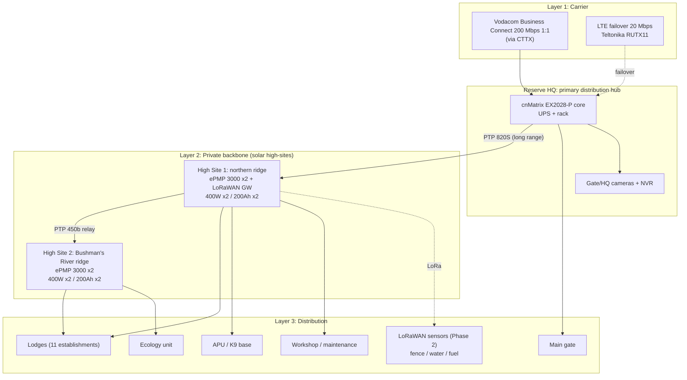

# Amakhala Game Reserve: Reserve Communications Backbone
## Desktop Proposal and Indicative Quotation

**Prepared for:** Richard, Amakhala Game Reserve
**Prepared by:** Gerhard Smit, CTTX Services
**Date:** 27 September 2026 | **Reference:** CTTX_Quote_Amakhala_2026-09-27 | **Valid until:** 27 October 2026
**Basis:** Desktop study only. All pricing is **indicative and subject to feasibility** (Vodacom site feasibility plus a CTTX line-of-sight survey).

---

## 1. Executive Summary

Amakhala runs 11 lodges and three central teams (Security & Anti-Poaching, Ecology, Maintenance) over roughly 7,500–9,000 ha of river-valley terrain between the Bushman's River and Addo. Published information suggests connectivity is handled lodge by lodge and mostly stops at the main building.

**The objective is not to buy another internet connection. It is to give the reserve one reliable communications backbone that serves its guests, its staff and its security operation.**

CTTX proposes a **hybrid reserve backbone**:

1. **Carrier:** one uncontended 1:1 Vodacom Business Connect service delivered by CTTX to a central entry point, with LTE failover.
2. **Private backbone:** two solar-powered ridge high-sites that give line of sight into the river valley and the northern plains.
3. **Distribution:** every lodge, the HQ, the APU base, the ecology unit, the workshop and the main gate on one managed network, with a LoRaWAN layer ready for fence, water point and camera-trigger sensors.

**In scope (Phase 1):** carrier entry and failover, backbone, 2 high-sites with solar and battery power, distribution to all lodges and operational sites, ops Wi-Fi at HQ, gate and APU, gate cameras, LoRaWAN gateway, installation, commissioning and handover.
**Out of scope (Phase 1):** in-room Wi-Fi inside each lodge (optional per lodge), fence-alarm sensors and nodes (Phase 2), PSI / digital radio replacement of the VHF system (separate assessment), trenching beyond survey-confirmed lengths.

## 2. Current Situation (to confirm with Amakhala)

- Wi-Fi at Hlosi, Woodbury Lodge, Bush Lodge and Woodbury Tented Camp is published as "public areas by the main lodge". Safari Lodge advertises Wi-Fi in all rooms.
- Security relies on an Equine APU, a K9 unit, aerial surveillance and a rhino monitoring programme. These field teams need communications well beyond lodge buildings and outside normal hours.
- **We have not yet received Amakhala's incident history or current connectivity costs.** Section 7 below is completed from those numbers, not from assumptions.

## 3. Three Business Drivers

| Driver | What the backbone must do at Amakhala |
|---|---|
| **Guest experience** | Give every lodge a guaranteed share of an uncontended feed, so guests and booking/POS systems are not competing on congested LTE |
| **Staff communication** | Join HQ, 11 lodges, the APU base, ecology and maintenance on one network with VoIP-grade reliability, including at night |
| **Security and operational continuity** | Keep gate cameras, sensors and APU communications running through load-shedding and carrier outages. Solar and battery power at every relay, with LTE failover at the entry point |

## 4. Architecture

Design rules: LOS-clear links only, fewest high-sites and hops, BER-first rather than speed-first, 98–99%+ availability target, Cambium + Victron + Hubble monitored stack. High-site positions are **desktop candidates** and are confirmed on survey.

## 5. Infrastructure: Phase 1 Indicative Quotation (ZAR excl. VAT)

### 5.1 Hardware
| Item | Model | Qty | Unit | Total |
|---|---|---|---|---|
| HQ core PoE+ switch | Cambium cnMatrix EX2028-P | 1 | 14,500 | 14,500 |
| Carrier failover gateway | Teltonika RUTX11 | 1 | 5,800 | 5,800 |
| HQ UPS 1kVA | APC SMT1000I | 1 | 6,200 | 6,200 |
| HQ wall rack 12U | Lexi 12U | 1 | 2,800 | 2,800 |
| Backbone HQ → High Site 1 | Cambium PTP 820S (pair) | 1 | 42,000 | 42,000 |
| Relay High Site 1 → High Site 2 | Cambium PTP 450b (pair) | 1 | 18,400 | 18,400 |
| Distribution sectors | Cambium ePMP 3000 | 4 | 8,500 | 34,000 |
| Ops Wi-Fi (HQ, gate, APU, workshop) | Cambium cnPilot e410 | 4 | 3,200 | 12,800 |
| Ethernet surge protection | Citel P8DT-48 | 12 | 680 | 8,160 |
| LoRaWAN gateway | Dragino DLOS8 | 1 | 4,200 | 4,200 |
| Gate/HQ cameras 4MP IR | Dahua IPC-HFW2849S | 4 | 1,850 | 7,400 |
| High-site solar panels 400W | — | 4 | 3,200 | 12,800 |
| High-site LiFePO4 200Ah (5-day autonomy) | — | 4 | 8,200 | 32,800 |
| MPPT 30A | — | 2 | 1,200 | 2,400 |
| SS antenna pole mounts | — | 6 | 450 | 2,700 |
| **Hardware subtotal** | | | | **206,960** |

**Price on application (quantities shown, excluded from totals):** ePMP subscriber modules × 10 (lodges and ops sites) · high-site masts and mounting steel × 2 · NVR × 1 · PoE injectors × 6.
Earthing and lightning protection are **included in CTTX scope**.

### 5.2 Cable and civil (measured)
| Item | Qty | Rate | Total |
|---|---|---|---|
| CAT6A armoured outdoor buried | 300 m | 45 | 13,500 |
| CAT6A STP indoor | 150 m | 28 | 4,200 |
| HDPE conduit 25 mm | 300 m | 18 | 5,400 |
| **Cable & civil subtotal** | | | **23,100** |

### 5.3 Trenching: TBD after survey
R180–250/m (standard soil) · R280–350/m (rocky) · R450–800/m directional drilling where required.

### 5.4 Labour
| Item | Qty | Rate | Total |
|---|---|---|---|
| Site survey, terrain/LOS validation and design | 3 days | 4,500 | 13,500 |
| 2-technician installation team | 10 days | 9,000 | 90,000 |
| Travel and accommodation (2 people × 10 nights) | 20 | 1,200 | 24,000 |
| Cable pulling and termination | 3 days | 4,500 | 13,500 |
| Commissioning and testing | 3 days | 4,500 | 13,500 |
| Documentation and handover | 2 half-days | 2,250 | 4,500 |
| **Labour subtotal** | | | **159,000** |

### 5.5 Summary
| Line | ZAR |
|---|---|
| Hardware | 206,960 |
| Cable & civil | 23,100 |
| Labour | 159,000 |
| **Subtotal** | **389,060** |
| Contingency 10% | 38,906 |
| **Project total (excl. trenching and POA items)** | **427,966** |
| VAT 15% | 64,195 |
| **Total incl. VAT** (trenching VAT TBD) | **492,161** |

## 6. Commercial Model

### 6.1 Monthly recurring (24-month term, Vodacom via CTTX)
| Service | Ex VAT / month | Incl. VAT / month |
|---|---|---|
| Business Connect 200 Mbps, uncontended 1:1, symmetrical, business SLA (recommended) | R9,424 | R10,838 |
| LTE failover 20 Mbps | R521 | R599 |
| **Monthly recurring total** | **R9,945** | **R11,437** |
| **24-month contract value** | **R238,680** | **R274,482** |

Once-off carrier connection: R3,444 ex VAT (R3,130 connection + R314 LTE activation).
Alternative: Business Connect 100 Mbps at R7,103 ex VAT/month. Final bandwidth is sized against confirmed peak usage.

### 6.2 Optional managed service
A CTTX managed service retainer of **R3,500–5,500/month** covers 24/7 monitoring (cnMaestro and Victron VRM), proactive fault response, firmware and security patching, and monthly network health reporting.

### 6.3 Shared-conservancy view (indicative)
Split evenly across the 11 establishments, the Phase 1 backbone works out to about **R38,900 CAPEX per establishment** and about **R904/month per establishment** for a share of a 1:1 200 Mbps feed with failover. The reserve's security and ecology operations are covered by the same infrastructure. The split model is for Amakhala to decide (equal share, by room count, or reserve levy).

## 7. Financial Case: Cost of Disconnection vs Value of Connected Operations

We will complete the payback calculation from Amakhala's **actual** current connectivity spend and incident history. The four lenses below show what that calculation covers.

| Lens | At Amakhala | What we will quantify with you |
|---|---|---|
| **Avoided loss** | Rhino, cheetah and fence integrity. Theft of fuel, batteries and solar gear. Lodge downtime and failed card payments | Cost of one serious incident (loss, veterinary, security surge, reputational impact) against the annual cost of the backbone. For context: one rhino loss or one major guest-service failure typically costs more than a year of recurring cost |
| **Operational efficiency** | Gates, water points, pumps and fences checked by vehicle | Vehicle trips per week that sensors and cameras remove, and the faster maintenance response |
| **Infrastructure ownership** | 11 lodges each renting their own connection | Replacing duplicated lodge-level spend with a reserve-owned, expandable asset for sensors, cameras and future automation |
| **Executive risk reduction** | Multiple owners, one reserve, one reputation | Real-time visibility for the Reserve GM and APU, evidence of operational diligence for owners, insurers and conservation partners |

**Payback period:** to be calculated once current recurring costs are received. We will not invent it.

## 8. Operational Outcome

When Phase 1 is complete, Amakhala can:
- reach the APU base, gates and every lodge on one private network, day and night, through load-shedding;
- give every lodge a reliable share of an uncontended business connection with automatic failover;
- stream gate and HQ cameras to a central point;
- add fence, water point and camera-trigger sensors (Phase 2) without new backbone work;
- join the CTTX Conservation Intelligence Platform (threat and incident mapping, moon phase × weather × water point correlation, and weekly risk maps).

## 9. Risks, Assumptions and Exclusions

### Risk table
| Risk | Likelihood | Impact | Mitigation |
|---|---|---|---|
| Ridge sites lack LOS into specific valley lodges | Medium | Medium | DEM and Link Planner study before survey. Add a sector or short relay only where terrain requires it |
| Vodacom feasibility at the chosen entry point | Medium | High | Feasibility confirmed with the Vodacom channel manager before order. An alternative carrier path is kept open |
| Theft or vandalism at high-sites | Medium | High | Anti-theft battery enclosures, remote monitoring, alarm triggers on enclosures |
| Lightning in exposed ridge positions | Medium | High | CTTX earthing and surge protection on every run |
| Access to ridge sites (4x4, environmental) | Low | Medium | Route planned with the reserve's ecology unit. Low-footprint mounting |

### Assumptions
Throughput 200 Mbps shared, 24-month term (to confirm). 11 establishments plus 5 ops endpoints. Reserve HQ has grid power and a secure room. Ridge access by 4x4. Pricing from the CTTX Standard Rate Card (May 2026) and the Vodacom rate card (June 2026). No Starlink or satellite in the design.

### Exclusions
In-lodge room Wi-Fi (optional per lodge). Phase 2 LoRaWAN sensor nodes. PSI / VHF replacement. Trenching (TBD). POA items listed in §5.1. Building works, permits or EIA if required.

### Terms
Validity 30 days · 50% deposit on order, 50% on commissioning sign-off · Warranty 24 months hardware, 12 months installation · Lead time 10–15 working days from deposit (after feasibility and survey).

## 10. Next Steps

1. **30-minute call with Richard** to confirm peak users, contract term, incident history and current connectivity spend.
2. **Share lodge, HQ, APU and gate locations** (KMZ or a marked map). CTTX then runs the terrain and LOS study.
3. **One-day site survey** to confirm high-sites and the carrier entry point (included in the labour above).
4. **Final quotation** with firm pricing and a calculated payback.

---
*Prepared by: Gerhard Smit | CTTX Services | gerhard@cttx.co.za | 084 550 3281*
